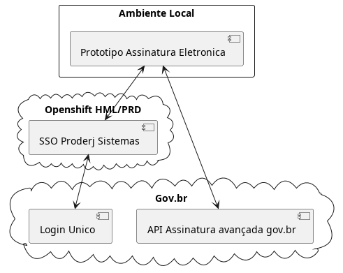

# Protótipo Assinatura Eletrônica

# ***ATENÇÃO: ESTE PROTÓTIPO NÃO ATENDE A REQUISITOS MÍNIMOS DE QUALIDADE E SEGURANÇA E NÃO DEVE SER USADO EM AMBIENTES PRODUTIVOS***

## Sobre.

Este protótipo foi baseado no exemplo apresentado no [ Roteiro de Integracão API Assinatura avançada gov.br ](https://manual-integracao-assinatura-eletronica.servicos.gov.br/pt-br/latest/iniciarintegracao.html#solicitacao-de-acesso)
para atender as exigências do processo de solicitação de integração com a API Assinatura Eletrônica.

## Links de Documentação

- [ Roteiro de Integracão API Assinatura avançada gov.br ](https://manual-integracao-assinatura-eletronica.servicos.gov.br/pt-br/latest/index.html)

- [ Roteiro de Integração do Login Único  ](https://acesso.gov.br/roteiro-tecnico/index.html)

## Orientações para homologação do sistema integrado

A homologação poderá ser realizada em reunião pelo Microsoft Teams ou envio de vídeo da aplicação demonstrando os 4 fluxos abaixo:

1. ***Demonstrar usuário realizando login no sistema***: Apresentar a tela inicial e usuário realizando sua autenticação no Login Único para iniciar sua jornada na utilização do sistema. Caso o sistema ainda tenha disponibilizado a autenticação por outro cliente de login, deverá constar no video o fluxo do sistema por este outro tipo de autenticação.

2. ***Demonstrar usuário realizando assinatura***: Apresentar a jornada do usuário até chegar à etapa de realizar a assinatura. Este processo poderá incluir a assinatura de um arquivo gerado pelo próprio sistema ou a assinatura de um arquivo que usuário tenha que anexar ao sistema, isso depende do fluxo de funcionamento do sistema do órgão.

3. ***Demonstrar teste com usuário conta bronze***: Caso sistema permita o login de usuário com a conta nível bronze, apresentar mensagem orientando o usuário adquirir conta com nível necessário para realizar assinatura. Exemplo de mensagem: “É necessário possuir conta gov.br nível prata ou ouro para utilizar o serviço de assinatura”. A aplicação cliente deve direcionar o usuário para adquirir nível necessário, verificar serviço de confiabilidades no link: [serviço de confiabilidades](https://acesso.gov.br/roteiro-tecnico/iniciarintegracao.html#acesso-ao-servico-de-catalogo-de-confiabilidades-selos)

4. ***Demonstrar usuário fazendo logout***: Apresentar como usuário realiza logout do sistema.# prototipo assinatura eletronica

## Estrutura do diretório

```bash
.
├── app.py                     # -> Entrypoint da aplicação.
├── Containerfile              # -> Containerfile de Desenvolvimento.
├── dependencies.txt           # -> Dependencias do projeto
├── docs                       # -> Recursos de documentação da aplicação.
│   └── ...
├── __pycache__
│   └── ...
├── README.md
├── static                     # -> arquivos públicos da aplicação.
│   ├── css
│   │   ├── ...
│   ├── img
│   │   ├── ...
│   └── js
│       └── ...
├── templates                  # -> Templates da aplicação
│   ├── layout
│   │   └── ...
│   └── pages
│       └── ...
└── uploads
    └── ...
```

## Topologia da Aplicação

